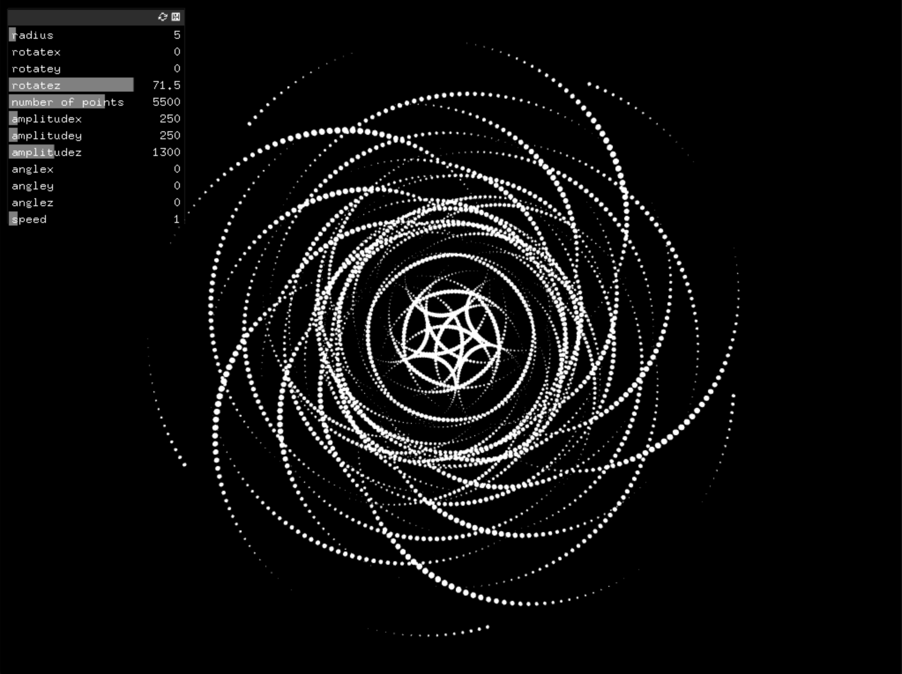
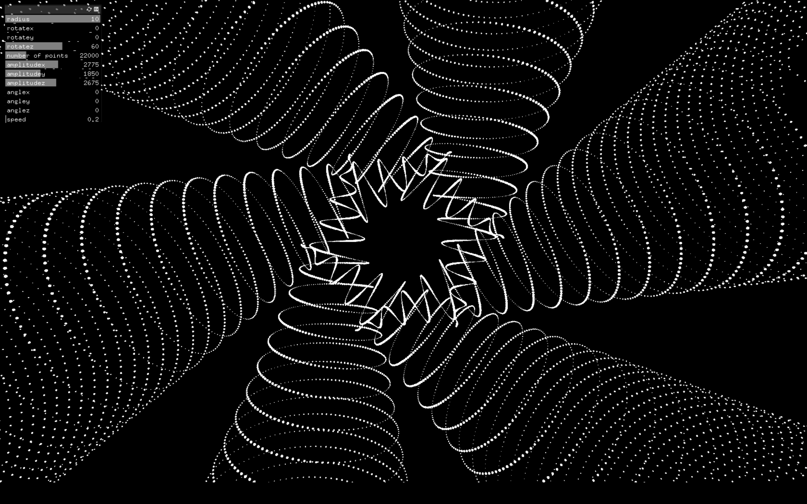
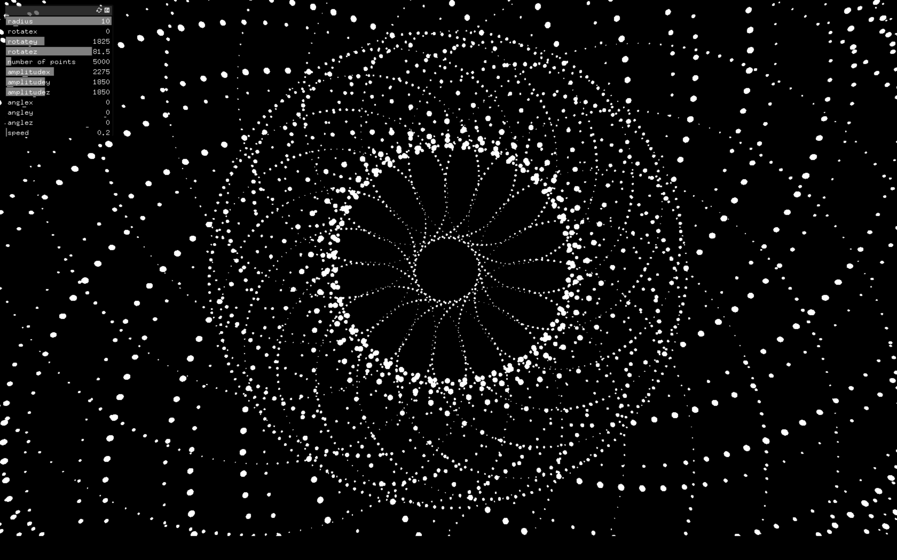
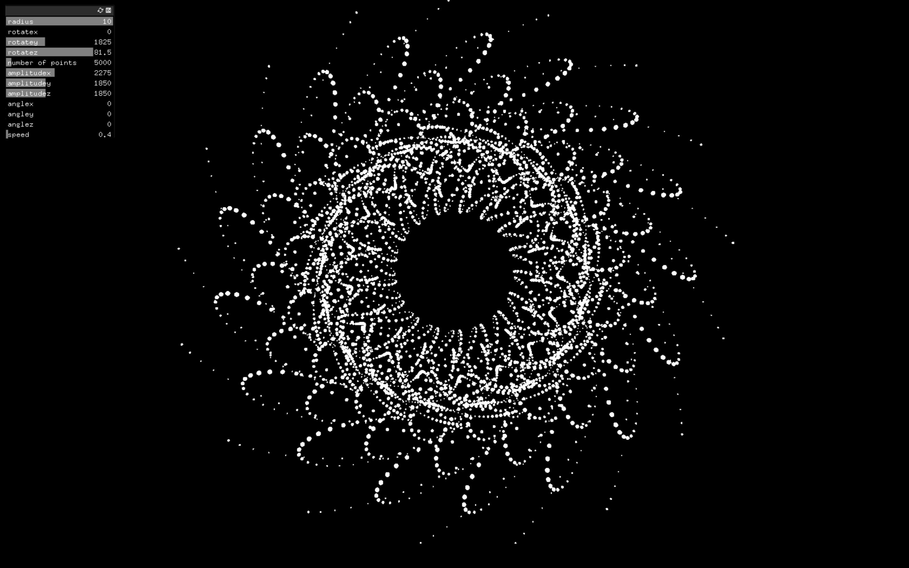

# Generative Forms
A openframeworks app to explore generative art in 3D space. 
This is a never ending work which may always be further explored.
Would love to see what kind crazy math results you can achieve.

## Usage:

Clone Repo.

```bash
git clone https://github.com/bernabranco/of-generative-forms.git
```

Place "generative_forms_1" in Openframeworks "Apps" folder;

Click the "Import" button in the ProjectGenerator and type "generative_forms_1";

Press "Update" button

## Add-Ons Required

- ofxGui

## Functionalities:

- Use keys "1-2-3-4-5-6-7-8-9-0" to change base visual
- use key "z" to hide/show GUI
- use mouseDrag and Zoom to change camera 3D perspective
- use GUI to change particle behaviour

## Images / Results






## Demo

https://user-images.githubusercontent.com/62609851/147410583-4f273511-ef41-4b9b-a0c7-5896f5da65fe.mp4

